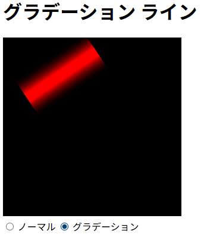

# gradation_line

## 概要

JavaScriptでグラデーション付きの線を描きます。



## コード

```js
/**
 * 2点間に幅を持った線（矩形ポリゴン）を描画し、その幅に対して垂直方向のグラデーションを適用する。
 * これにより、線の中心が最も濃く、端に向かって色が薄くなる（または透明になる）視覚効果が得られる。
 * @param {CanvasRenderingContext2D} ctx - 描画に使用するCanvas 2Dコンテキスト。
 * @param {number} x0 - 始点 (P0) のX座標。
 * @param {number} y0 - 始点 (P0) のY座標。
 * @param {number} x1 - 終点 (P1) のX座標。
 * @param {number} y1 - 終点 (P1) のY座標。
 * @param {string} [centerColor=ctx.strokeStyle] - 線の中心に適用する色。指定がない場合は現在の strokeStyle を使用。
 * @param {string} [edgeColor='rgba(0, 0, 0, 0%)'] - 線の両端（エッジ）に適用する色（通常は透明）。
 */
const drawLineWithGradation = (ctx, x0, y0, x1, y1, centerColor = ctx.strokeStyle, edgeColor = 'rgba(0, 0, 0, 0%)') => {
    const halfWidth = ctx.lineWidth / 2; // 半分の幅
    // 1. 方向ベクトルの計算
    const dx = x1 - x0, dy = y1 - y0;
    // 2. 法線ベクトルの計算 (時計回りに90度回転)
    const nx = dy, ny = -dx;
    // 法線ベクトルを正規化（長さ1にする）
    const len = Math.sqrt(nx * nx + ny * ny);
    const normX = nx / len, normY = ny / len;
    // 3. 矩形の4つの頂点を計算
    // 始点P1から法線方向に +/- halfWidth オフセット
    const p0x = x0 + normX * halfWidth;
    const p0y = y0 + normY * halfWidth;
    const p1x = x0 - normX * halfWidth;
    const p1y = y0 - normY * halfWidth;
    // 終点P2から法線方向に +/- halfWidth オフセット
    const p2x = x1 - normX * halfWidth;
    const p2y = y1 - normY * halfWidth;
    const p3x = x1 + normX * halfWidth;
    const p3y = y1 + normY * halfWidth;
    // 4. 頂点を結んで多角形を作成
    ctx.beginPath();
    ctx.moveTo(p0x, p0y);
    ctx.lineTo(p1x, p1y);
    ctx.lineTo(p2x, p2y);
    ctx.lineTo(p3x, p3y);
    ctx.closePath();
    // 5. グラデーションの作成
    // 線の端（グラデーションの開始点と終了点）
    // 線の中心から法線ベクトルの方向に halfWidth 分オフセットした点
    const gradStartPointX = x0 - normX * halfWidth;
    const gradStartPointY = y0 - normY * halfWidth;
    const gradEndPointX = x0 + normX * halfWidth;
    const gradEndPointY = y0 + normY * halfWidth;
    const gradient = ctx.createLinearGradient(
        gradStartPointX, gradStartPointY,
        gradEndPointX, gradEndPointY);
    // 中心 (40%～60%)
    gradient.addColorStop(0.4, centerColor);
    gradient.addColorStop(0.6, centerColor);
    // 端 (0% と 100%)
    gradient.addColorStop(0.0, edgeColor);
    gradient.addColorStop(1.0, edgeColor);
    // 5. 塗りつぶし
    ctx.fillStyle = gradient;
    ctx.fill();
};
```
